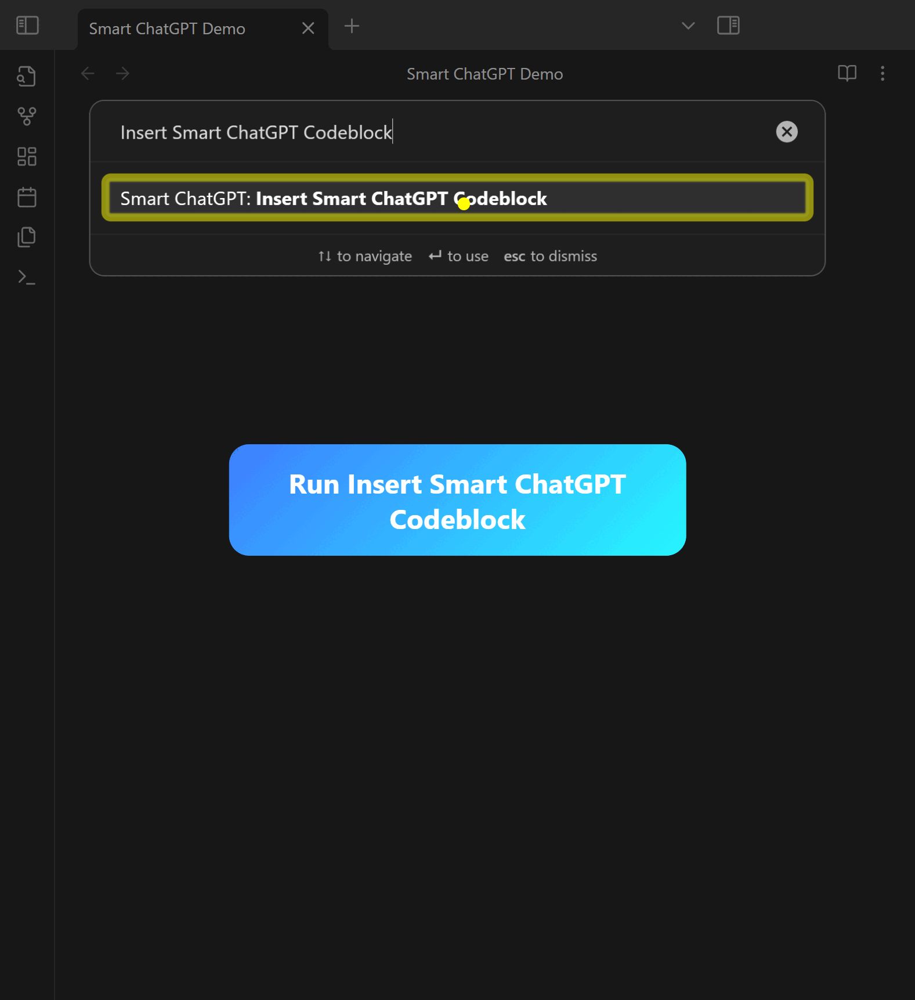

> [!INFO] 2025-12-11 this page is a WIP, see https://smartconnections.app/smart-chat

<h2 align="center">
Conversations stay with your notes<br>
</h2>

> [!QUESTION] **Why juggle browser tabs or copied prompts?**
> Keep conversations inside Obsidian with Smart Chat and let your vault supply the context.

> [!WARNING] **The Problem**
> Switching between external chat tools and your notes breaks focus, leaks context, and risks sending private data to the wrong place.

> [!SUCCESS] **What success looks like**
> Stay in flow: start a thread, pull in notes with `@`, review context before sending, and answer follow-ups without leaving Obsidian.

> [!FAILURE] **The cost of doing nothing**
> Context keeps leaking across tools. You lose time re-reading notes, copy/pasting prompts, and second-guessing what was sent to which provider.

# Smart Chat

Smart Chat adds a dedicated chat view powered by the shared **Smart Environment** so your conversations stay close to your vault. Upgrade to Smart Chat Pro for cloud and advanced local provider workflows while keeping privacy-first defaults explicit.



## What Smart Chat does
- Context-aware responses sourced from your vault via Smart Environment.
- Private & local-first defaults; choose when anything leaves your machine.
- Threaded conversations with system prompts, context review, and action hooks.
- Bring your own models: local (Ollama) or Smart Chat Pro providers (OpenAI, Anthropic, Gemini, Azure, and more).

## Core vs Pro
- **Core**: Embedded chat view and thread management to better enable asynchronous AI workflows from within Obsidian.
- **Pro**: Provider adapters, per-thread routing, streaming, and tool-calling via Smart Environment actions. You decide which messages or contexts leave your vault.

## Quick start
> [!TLDR] 3 steps
> 1. Install **Smart Chat** from Obsidian Community plugins and enable it.
> 2. Open the **Smart Chat** view from the ribbon or sidebar.
> 3. Choose a model: local Ollama (default) or a Smart Chat Pro provider, then start chatting with `@` to pull context.

## Chat Pro API flow
1. Start a new thread and set the system prompt for the task at hand.
2. Pull in notes with `@` to review and edit context before sending.
3. Route responses per-thread to Ollama or a Smart Chat Pro adapter depending on privacy or latency needs.
4. Trigger Smart Environment actions (like Smart Context) when you need refreshed context or links.

### Pro: provider routing and adapters
- Smart Chat Pro ships adapters for OpenAI, Anthropic, Gemini, Azure OpenAI, and more through the Smart Environment.
- Routing is explicit: each thread can target a different provider or stay on Ollama. Context only leaves your machine when you choose a cloud adapter.
- Settings live under **Smart Chat Pro** with clear API key inputs and model selectors per provider.

## Built for you
> Smart Chat started as a way to keep conversations and context together. The Obsidian community has helped shape it into a flexible interface for local-first AI workflows.

- Keep private notes local by default; switch to cloud providers only when you choose.
- Chat UI matches the Connections storytelling so onboarding feels consistent across Smart Plugins.


> [!NOTE] Stop losing your conversations!
> Hey there! I'm 🌴 Brian. I found myself constantly juggling browser tabs for different AI chats while working on my notes. I'd lose track of important conversation threads and waste time trying to map them back to the right project.
>
> This plugin is my solution. It brings your AI chats right into the Obsidian notes where they belong. It's built to create a seamless, asynchronous workflow with AI, making sure your valuable discussions are always organized and right where you need them.
### Key features
- 💬 **Embed Multiple AIs**: Works with ChatGPT, Anthropic Claude, Google Gemini, Perplexity, DeepSeek, xAI Grok, and Google AI Studio.
- 🔗 **Automatic Link Saving**: Conversation URLs save back into your note.
- ✅ **Simple Task Management**: Mark conversations as "active" or "done".
- 📂 **Multi-Thread Management**: Switch between threads inside a note.
- 📊 **Dataview Integration**: Build dashboards from `chat-active` and `chat-done` fields.

### Getting started with codeblocks
1. Install **Smart ChatGPT** from Obsidian Community plugins.
2. Insert a codeblock from the command palette (e.g., `Insert OpenAI ChatGPT codeblock`).
3. Start chatting; the plugin detects thread URLs and saves them to the block.

#### Examples
````md
```smart-chatgpt
```
````

When you start a conversation, the plugin automatically updates the codeblock with the new thread's URL, marking it as `chat-active`.

````md
```smart-chatgpt
chat-active:: 1709719305 https://chatgpt.com/c/some-new-thread
```
````

### Managing Conversations

* **Mark as Done**: When you're finished with a conversation, click the **“Mark Done”** button. The plugin will update the line to `chat-done`. This is great for tracking tasks.
* **Switching Threads**: If you have multiple threads in one codeblock, a dropdown menu appears, letting you easily switch between them. Done threads are marked with a ✓.

#### Dataview snippets

Because the plugin saves thread status directly in your notes as `chat-active` or `chat-done`, you can use [Dataview](https://github.com/blacksmithgu/obsidian-dataview) to create powerful dashboards.
````md
# In Progress
```dataview
LIST WITHOUT ID file.link
WHERE chat-active
SORT file.mtime DESC
```
````

````md
# Completed
```dataview
LIST length(file.chat-done) + " completed"
WHERE chat-done
SORT length(file.chat-done) DESC
```
````

## Codeblocks for Supported AI Chat Services

Use a specific codeblock for each service:

| Codeblock          | Service              |
| ------------------ | -------------------- |
| `smart-chatgpt`    | **OpenAI ChatGPT**   |
| `smart-claude`     | **Anthropic Claude** |
| `smart-gemini`     | **Google Gemini**    |
| `smart-deepseek`   | **DeepSeek**         |
| `smart-perplexity` | **Perplexity**       |
| `smart-grok`       | **xAI Grok**         |
| `smart-aistudio`   | **Google AI Studio** |

### FAQ
- **Claude won't sign in**: Enable Obsidian's **Web viewer** core plugin, log in via Web viewer, then refresh the embedded chat.
- **Google sign-in errors**: Use Web viewer to complete authentication, then return to the note and refresh.
- **AI Studio thread link isn't saved**: After sending the first message, click **Save** in AI Studio so Smart Chat can capture the URL.
- **Can I use Open WebUI (Ollama) with Chat Pro API?** Yes. Set the `path` setting to `api/chat/completions` in **Settings → Smart Chat → Path**.
- **Where does my data live?** Core Smart Chat keeps conversations, context, and embeddings inside your vault via Smart Environment. Only providers you configure in Smart Chat Pro receive data you choose to send.
- **How do I switch models?** Each thread stores its own model selection. Use thread settings to pick an Ollama model or a Smart Chat Pro provider without restarting Obsidian.
- **Does Smart Chat work with Smart Connections?** Yes. Smart Connections handles discovery across your vault, while Smart Chat handles conversations. Both run on Smart Environment so context, models, and actions stay in sync.

## Part of the Smart Ecosystem

Smart ChatGPT is a proud member of the [Smart Plugins](https://smartconnections.app) family, which includes the flagship **[Smart Connections](https://obsidian.md/plugins?id=smart-connections)** plugin.

Our mission is to build user-aligned, privacy-first tools that empower you to think better and achieve your goals. We believe in software that is:

* 🔐 **Private & Local-First**: Your data stays with you.
* 🌐 **Open-Source**: Transparent and community-driven.
* ⚔️ **Mission-Driven**: Built to empower you, not to profit from your data.

Come for the tools, stay for the community and our shared vision of thriving with AI.

---

Developed by 🌴 Brian | [smartconnections.app](https://smartconnections.app)
