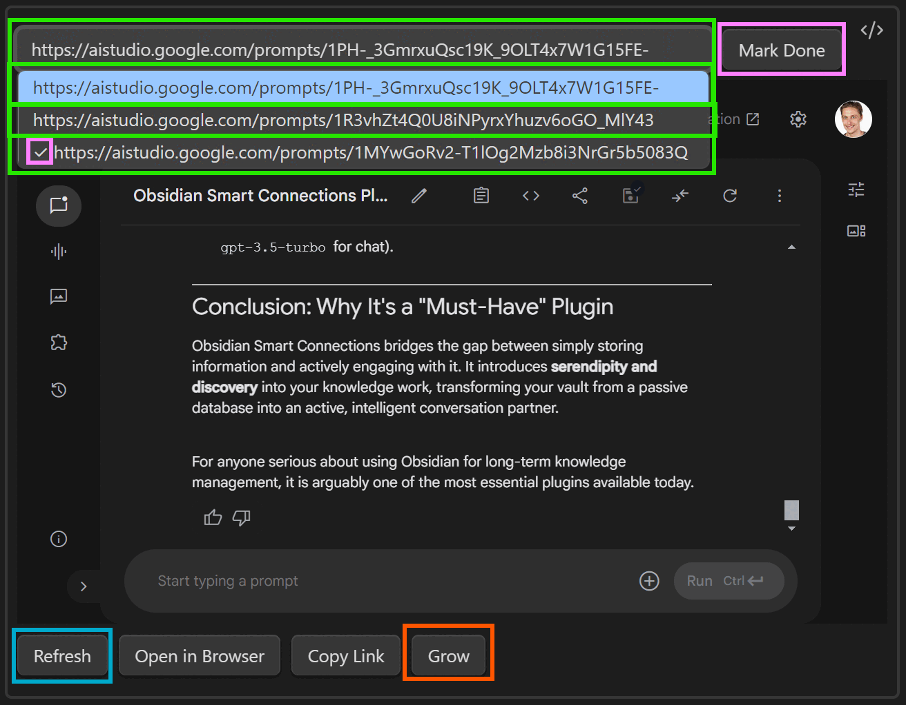

# Smart Chat (fmr. Smart ChatGPT)

<h2 align="center">
Keep AI threads with the notes they belong to<br>
</h2>
<p align="center">
Works with the AI you already use. Keep chats saved to relevant notes.
</p>



> [!QUESTION] **Why let useful chats become orphaned browser tabs?**
> Put the thread beside the project, meeting, research note, or draft it belongs to.

> [!WARNING] **The Problem**
> Good chats drift away from the notes that matter.

> [!NOTE] **What Smart Chat does**
> Smart Chat keeps conversations inside your notes. The Chat codeblock automatically saves your chats with AI in the note. Works with ChatGPT, Claude, Gemini, Grok and more. No API key required.

> [!SUCCESS] **What success looks like**
> Start a thread from the note, resume it later from the same note, keep chats with your work, and close the loop by marking threads done.


## Quick start

> [!TLDR] 3 steps
> 1. Install **Smart ChatGPT** from Obsidian Community plugins and enable it.
> 2. Insert a provider codeblock from the command palette, such as **Insert OpenAI ChatGPT codeblock**.
> 3. Chat in the embedded view. Smart Chat saves the thread URL back into the note so you can resume later.


## Flow

1. Add a provider codeblock to the note where the thread belongs.
2. Start or resume the conversation inside the embedded chat UI.
3. Let Smart Chat save the thread URL directly into the note.
4. Mark the thread done when the work is complete, or surface it later with Dataview.


## Getting started with codeblocks

### Minimal example
````md
```smart-chatgpt
```
````

### Example of a saved block
````md
```smart-chatgpt
chat-active:: 1767302492 https://chatgpt.com/c/6956e559-8060-8329-8150-7167e477c05a
chat-done:: 1767132305 https://chatgpt.com/c/69544c91-0c78-832e-8e49-d21049a33e51
```
````

### Supported provider codeblocks
| Codeblock | Provider |
| --- | --- |
| `smart-chatgpt` | ChatGPT (also recognizes Codex and Sora links) |
| `smart-claude` | Claude |
| `smart-gemini` | Gemini |
| `smart-grok` | Grok |
| `smart-perplexity` | Perplexity |
| `smart-deepseek` | DeepSeek |
| `smart-aistudio` | Google AI Studio |
| `smart-openwebui` | Open WebUI |
| `smart-kimi` | Kimi |

## Dataview snippets

Because Smart Chat stores thread state directly in your notes, Dataview can turn your vault into an async dashboard.

````md
# In Progress
```dataview
LIST WITHOUT ID file.link
WHERE chat-active
SORT file.mtime DESC
```
````

````md
# Completed
```dataview
LIST WITHOUT ID file.link
WHERE chat-done
SORT file.mtime DESC
```
````

## FAQ
- **Claude won't sign in**: Enable Obsidian's **Web viewer** core plugin, log in via Web viewer, then refresh the embedded chat.
- **Google sign-in errors**: Use Web viewer to complete authentication, then return to the note and refresh.
- **Do I need an API key?** No. Use the web UIs you already use.
- **Where does my data live?** The codeblock stores thread links in your notes.
- **Does Smart Chat work on mobile?** The saved thread links are accessible on mobile, but the full embedded web UI experience depends on Obsidian desktop webview support.
- **Can I use Open WebUI (Ollama) with Smart Chat?** Yes. Use the `smart-openwebui` codeblock and set the base URL in **Settings → Smart ChatGPT → Open WebUI base URL**.


---

Developed by Brian | [smartconnections.app](https://smartconnections.app)
